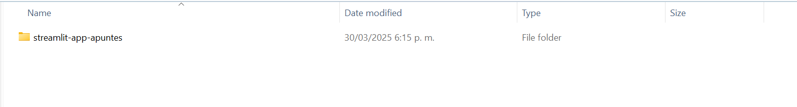
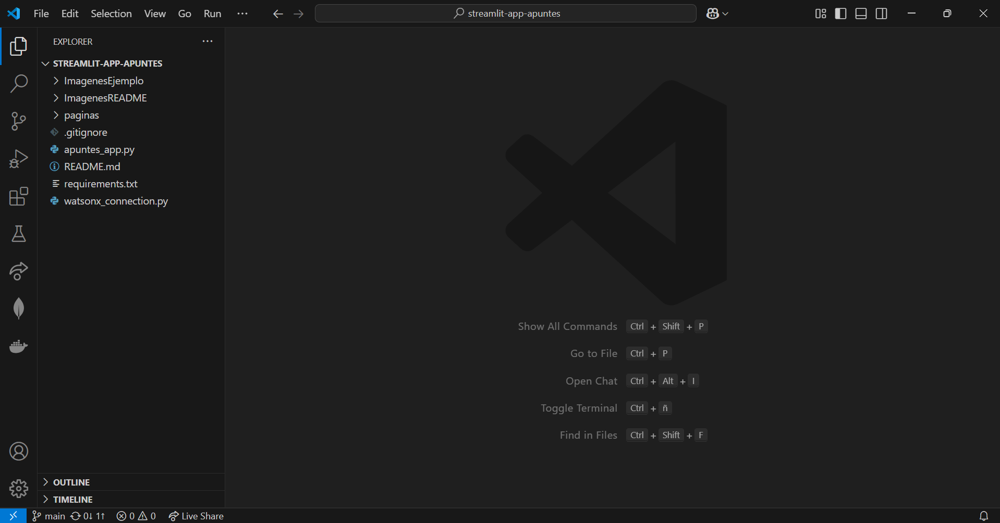
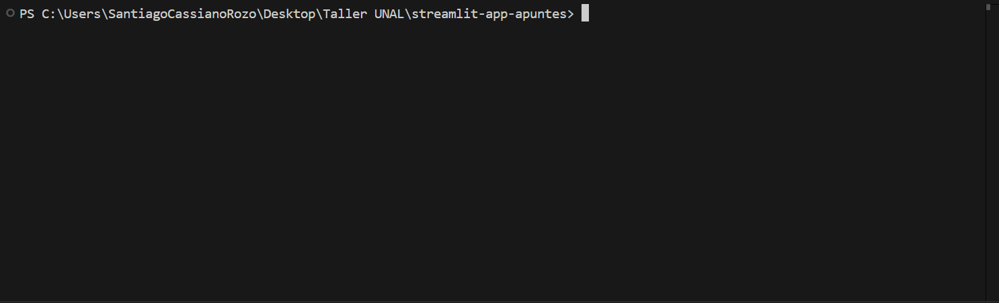
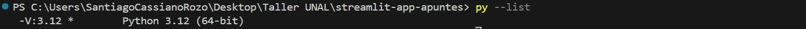

# Apuntes App

### Prerrequisitos:
- Tener instalado Python. (Python 3.12.9 es la version recomendada)
- (Opcional) Tener instalado Visual Studio Code.

### Paso 1: Clonar o descargar este repositorio en tu computadora.



### Paso 2: Abre el repositorio con un editor de código (Se recomienda Visual Studio Code).



### Paso 3: Crear un entorno virtual de Python para ejecutar la aplicación. 

Adventencia: Los pasos mostrados a continuación fueron realizados en un equipo con Windows. Para otros sistemas operativos los comandos pueden variar un poco.

#### Paso 3.1: Crear una terminal ubicada en la carpeta del proyecto:



#### Paso 3.2: Verificar las versiones de Python instaladas en su computadora.

Para verificar la versión de python instalada en el equipo se puede usar el comando:

```console
py --list
```

En la consola se deberia ver una lista de las versiones de Python instaladas. Por ejemplo, en este caso unicamente se tiene instalada la version 3.12:



#### Paso 3.3: Crear el entorno virtual con una version de Python espefica:

Para crear un entorno virtual con nombre _.env_ se debe usar el siguiente comando, donde la X se debe remplazar por la versión de Python con la que se quiere crear el entorno virtual:

```console
py -3.X -m venv .venv
```

Por ejemplo, para el caso de Python 3.12 seria:

```console
py -3.12 -m venv .venv
```


