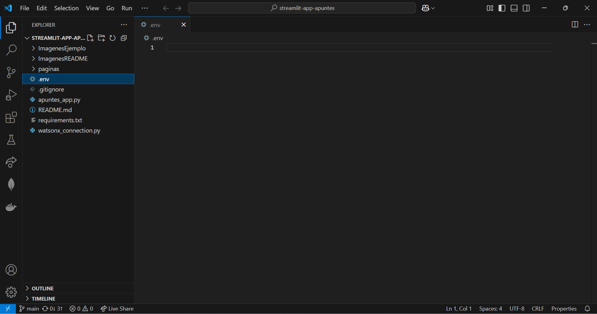
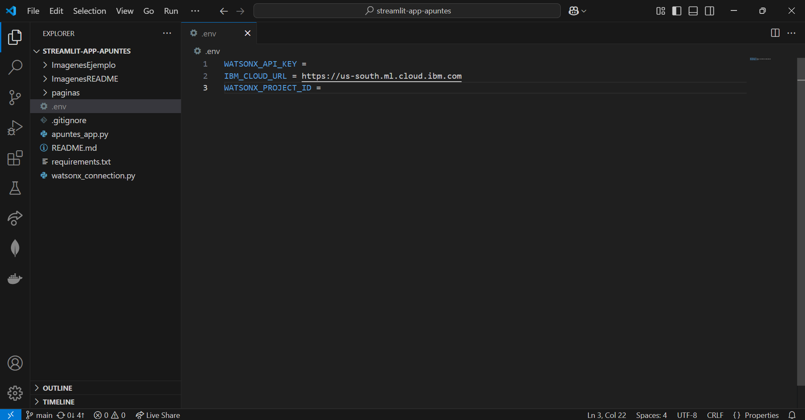
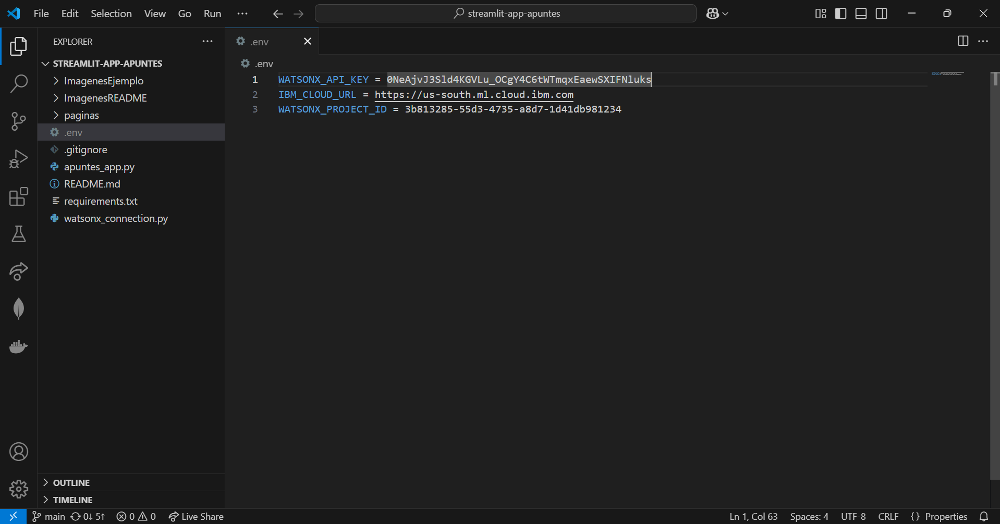
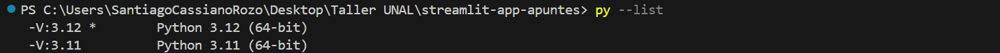
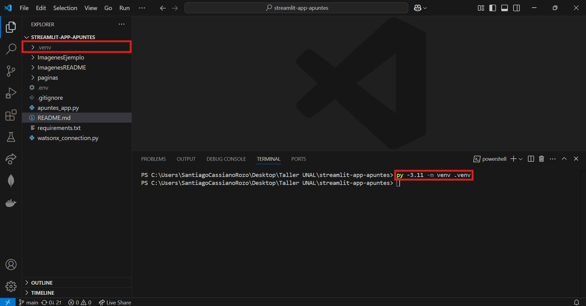
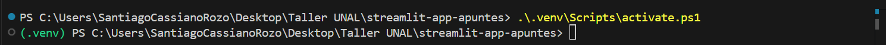

# Guia para la ejecución local de Apuntes App

## Prerrequisitos:
- Tener instalado Python. (Python 3.12.9 es la version recomendada)
- (Opcional) Tener instalado Visual Studio Code.

## Paso 1: Clonar o descargar este repositorio en tu computadora.


## Paso 2: Abre el repositorio con un editor de código (Se recomienda Visual Studio Code).


## Paso 3: Crear un archivo _.env_ con las variables de entorno necesarias para acceder a Watson.

### Paso 3.1: Crear el archivo _.env_ en la carpeta del proyecto.

Se debe crear un archivo que unicamente se llame _.env_ en la carpeta del proyecto. Es recomendable crearlo desde Visual Studio Code, para asegurar se que el nombre del archivo sea unicamente _.env_

Tras crear el archivo, el proyecto deberia verse de la siguiente manera:



### Paso 3.2: Escribir las variables de entorno necesarias en el archivo _.env_:

Las variables de entorno que se deben escribir son las siguientes:

```python
WATSONX_API_KEY = 
IBM_CLOUD_URL = https://us-south.ml.cloud.ibm.com
WATSONX_PROJECT_ID = 
```

Se deben copiar estas tres variables dentro del archivo _.env_ del proyecto:



Tras esto, debe escribir el API_KEY y el Project_ID que le entreguen los tutores durante el taller en las variables WATSONX_API_KEY y WATSONX_PROJECT_ID respectivamente.

Un ejemplo de cómo deberia verse el archivo _.env_ tras incluir los valores dados por los tutores es el siguiente:



### Paso 3.3: Guardar y cerrar el archivo _.env_

### Paso 4: Crear un entorno virtual de Python para ejecutar la aplicación. 

Adventencia: Los pasos mostrados a continuación fueron realizados en un equipo con Windows. Para otros sistemas operativos los comandos pueden variar un poco.

#### Paso 4.1: Crear una terminal ubicada en la carpeta del proyecto:


#### Paso 4.2: Verificar las versiones de Python instaladas en su computadora.

Para verificar la versión de python instalada en el equipo se puede usar el comando:

```console
py --list
```

En la consola se deberia ver una lista de las versiones de Python instaladas. Por ejemplo, en este caso unicamente se tiene instalada la version 3.12:



#### Paso 4.3: Crear el entorno virtual con una version de Python espefica:

Para crear un entorno virtual con nombre _.venv_ se debe usar el siguiente comando, donde la X se debe remplazar por la versión de Python con la que se quiere crear el entorno virtual:

```console
py -3.X -m venv .venv
```

Por ejemplo, para el caso de Python 3.12 seria:

```console
py -3.12 -m venv .venv
```

Tras ejecutar el comando debio crearse la carpeta _.venv_ dentro del proyecto:



### Paso 5: Activar el entorno virtual en una consola:

#### Paso 5.1: Crear una terminal ubicada en la carpeta del proyecto:


#### Paso 5.2: Activar el entorno virtual en la terminal

Para activar el entorno virtual se debe ejecutar el siguiente comando en la terminal de Powershell:

```console
.\.venv\Scripts\activate.ps1
```

En caso de que sea una terminal de comandos de Windows se puede ejecutar: 
```console
.\.venv\Scripts\activate.bat
```

Tras ejecutar el comando en la parte izquierda de la terminal deberia verse el nombre del entorno virtual activado:



